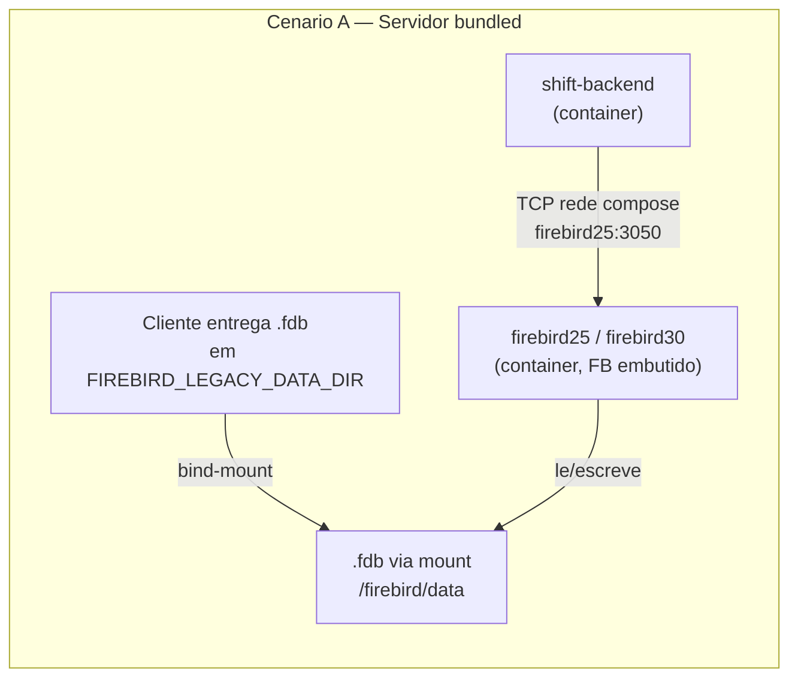
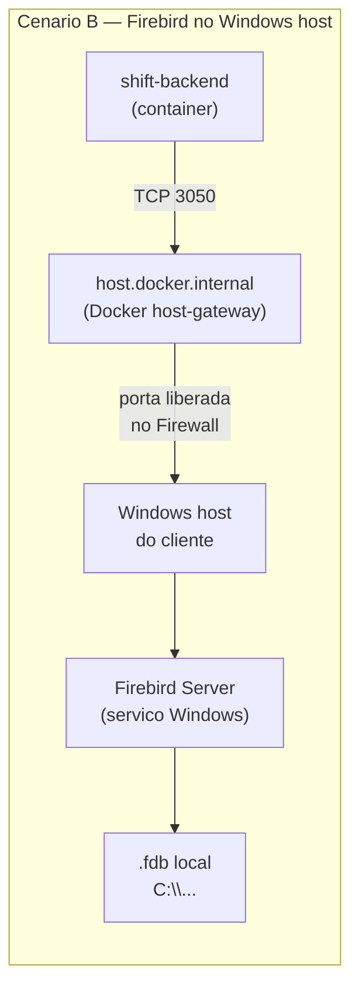
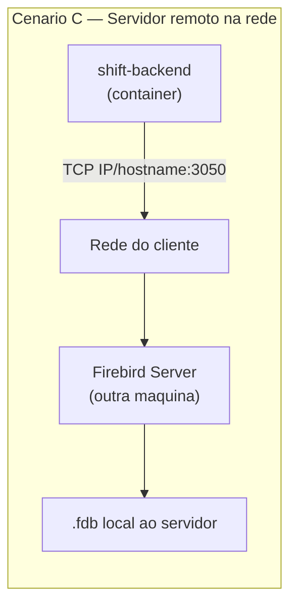

# Deploy do Shift com Firebird

Guia operacional unico para implantar o Shift em clientes que usam Firebird
como fonte ou destino de dados. Cobre os 3 cenarios suportados, comandos
prontos para o cliente, troubleshooting estruturado e referencia tecnica.

---

## 1. Visao geral

A Shift suporta 3 cenarios de Firebird, escolhidos pelo wizard no formulario
de conexao do frontend e/ou inferidos do `host` informado.

### Os 3 cenarios







### Como escolher o cenario certo

Pergunte ao cliente nesta ordem:

1. **"O Firebird ja esta instalado e rodando?"**
   - **Nao** → Cenario A (bundled).
   - **Sim** → continue.
2. **"Em qual maquina o Firebird esta?"**
   - **Mesma maquina onde o Shift vai rodar (Windows)** → Cenario B.
   - **Outra maquina na rede** → Cenario C.

O wizard do frontend (modal de conexao Firebird) tem cards correspondentes
e auto-preenche `host`/`port` para A e B. Veja
[connection-form-modal.tsx](../shift-frontend/components/dashboard/connection-form-modal.tsx).

---

## 2. Cenario A — Servidor bundled

### Quando usar

Cliente entrega apenas o arquivo `.fdb` e nao tem (ou nao quer instalar)
Firebird Server. A Shift sobe FB 2.5 ou 3.0 em container, monta o arquivo
do cliente via bind-mount e expoe via DNS interno do compose.

Tipico para clientes com ERPs antigos onde o `.fdb` e o unico artefato e
o cliente nao quer mexer no servidor existente.

### Pre-requisitos no cliente

- Docker 20.10+ instalado (Docker Desktop, Engine no WSL2 ou Linux nativo).
- Acesso ao `.fdb` (arquivo da base do ERP).
- ODS do `.fdb` precisa ser FB 2.x (ODS 11.x) ou FB 3.0+ (ODS 12+).
  ODS 10 (FB 1.x) NAO e suportado.

### Passo-a-passo

1. **Crie a pasta padrao Shift** no host (convencao universal — wizard,
   placeholders e exemplos assumem esse caminho):

   ```powershell
   # Windows (PowerShell)
   New-Item -ItemType Directory -Force -Path C:\Shift\Data
   ```

   ```bash
   # Linux
   sudo mkdir -p /opt/shift/data && sudo chown "$USER" /opt/shift/data
   ```

2. **Configure `.env`** na raiz do projeto apontando pra pasta padrao:

   ```bash
   # Windows
   FIREBIRD_LEGACY_DATA_DIR=C:/Shift/Data
   # Linux
   FIREBIRD_LEGACY_DATA_DIR=/opt/shift/data

   FIREBIRD_LEGACY_PASSWORD=masterkey
   ```

   `FIREBIRD_LEGACY_DATA_DIR` e o diretorio do **host** que sera montado em
   `/firebird/data` dentro dos containers. Em ambientes de desenvolvimento
   tambem aceita path relativo (ex: `./firebird-data`) — para producao,
   sempre use a convencao acima.

3. **Coloque o `.fdb`** dentro desse diretorio:

   ```text
   C:\Shift\Data\               (Windows)   |   /opt/shift/data/        (Linux)
   |-- EMPRESA.FDB                          |   |-- EMPRESA.FDB
   `-- OUTRA_BASE.FDB                       |   `-- OUTRA_BASE.FDB
   ```

4. **Suba o stack com o profile `firebird-legacy`**:

   ```bash
   docker compose --profile firebird-legacy up -d
   docker compose ps   # firebird25 e firebird30 devem aparecer (healthy) em <1min
   ```

5. **No frontend**, crie a conexao escolhendo o cenario "Tenho apenas o
   arquivo .fdb". Wizard preenche automaticamente:
   - `host` = `firebird25` ou `firebird30` (segundo a versao escolhida).
   - `port` = `3050`.
   - `database` = `C:\Shift\Data\EMPRESA.FDB` (Windows) ou
     `/opt/shift/data/EMPRESA.FDB` (Linux). Backend traduz para
     `/firebird/data/EMPRESA.FDB` antes de chamar o driver.

6. **Teste** clicando em "Testar conexao" no proprio modal — as 4 etapas
   (DNS, TCP, greeting, auth_query) devem passar antes de salvar.

### Estrutura de diretorios esperada

| Caminho host (convencao Shift)                              | Caminho container                                | Mount |
| ----------------------------------------------------------- | ------------------------------------------------ | ----- |
| `C:\Shift\Data` (Windows) / `/opt/shift/data` (Linux)       | `/firebird/data` em `firebird25` e `firebird30`  | rw    |
| Mesmo caminho host                                          | `/firebird/data` em `shift-backend`              | ro (so leitura para auto-deteccao de ODS) |

### Como testar

```bash
# Healthcheck do FB 2.5 bundled
docker compose ps firebird25
# STATUS deve ser 'Up X (healthy)'

# Conectividade do backend ate o FB bundled
docker compose exec shift-backend bash -c '</dev/tcp/firebird25/3050 && echo OK'
docker compose exec shift-backend bash -c '</dev/tcp/firebird30/3050 && echo OK'
```

---

## 3. Cenario B — Firebird no Windows host

### Quando usar

Cliente ja tem Firebird Server rodando no **mesmo Windows** onde o Shift
vai rodar (via Docker Desktop ou Docker Engine no WSL2). O backend conecta
via `host.docker.internal:3050`.

### Pre-requisitos no Windows

- Firebird Server 2.5 ou 3.0+ instalado e rodando como servico Windows.
- Porta 3050 liberada no Windows Firewall (configurar abaixo).
- `firebird.conf` aceitando conexoes externas (ver abaixo).

### Comandos PowerShell prontos para o cliente

Execute em **PowerShell como administrador**:

```powershell
# 1. Verifica se o servico Firebird esta rodando
Get-Service | Where-Object { $_.Name -like "Firebird*" }
# Esperado: Status=Running, ex: FirebirdServerDefaultInstance ou FirebirdServerDefault

# 2. Libera a porta 3050 no Firewall
New-NetFirewallRule `
  -DisplayName "Firebird 3050" `
  -Direction Inbound `
  -Protocol TCP `
  -LocalPort 3050 `
  -Action Allow

# 3. Descobrir versao instalada
Get-ItemProperty "HKLM:\SOFTWARE\Firebird Project\Firebird Server\Instances\*" `
  | Select-Object PSChildName, RootDirectory

# 4. Restart do servico (apos editar firebird.conf)
Restart-Service FirebirdServerDefaultInstance   # FB 2.5
# OU
Restart-Service FirebirdServerDefault           # FB 3.0+
```

Para remover a regra de Firewall depois:

```powershell
Remove-NetFirewallRule -DisplayName "Firebird 3050"
```

### Conferir `firebird.conf`

O default ja escuta em `0.0.0.0:3050`, mas se o cliente endureceu a config
e setou `RemoteBindAddress = 127.0.0.1`, o servidor so aceita localhost e o
container nao alcanca.

Localizacao tipica:
- Firebird 2.5: `C:\Program Files\Firebird\Firebird_2_5\firebird.conf`
- Firebird 3.0+: `C:\Program Files\Firebird\Firebird_3_0\firebird.conf`

Garanta:

```ini
# Comentado OU explicitamente 0.0.0.0
RemoteBindAddress = 0.0.0.0
RemoteServicePort = 3050
```

Em FB 3.0+, se o cliente legado (FB 2.5) precisar conectar, baixe o
`WireCrypt`:

```ini
# Required = bloqueia clientes legados; Enabled = aceita ambos.
WireCrypt = Enabled
```

### Configuracao no Shift

No frontend, escolha o cenario "O servidor Firebird roda na maquina
Windows". Wizard preenche:
- `host` = `host.docker.internal` (read-only, chip "Host do Docker").
- `port` = `3050` (editavel).
- `database` = path Windows literal (ex: `C:\Sistemas\ERP\BASE.FDB`) — NAO
  e traduzido. O backend encaminha o path como o servidor Windows o ve.

### Como testar

```bash
# DNS resolve dentro do container?
docker compose exec shift-backend getent hosts host.docker.internal
# Saida esperada: <IP-do-host>  host.docker.internal

# TCP alcanca a porta 3050 do Firebird remoto?
docker compose exec shift-backend bash -c '</dev/tcp/host.docker.internal/3050 && echo OK'
# Saida esperada: OK
# Se travar / der "Connection refused": Firewall do Windows ou RemoteBindAddress.
```

### Resolucao de `host.docker.internal`

| Ambiente                       | Resolve out-of-the-box? | Acao          |
| ------------------------------ | ----------------------- | ------------- |
| Docker Desktop (Mac / Windows) | Sim                     | Nada — Docker Desktop injeta o DNS automaticamente. |
| Docker Engine puro **WSL2**    | Nao                     | Resolvido por `extra_hosts: ["host.docker.internal:host-gateway"]` em `docker-compose.yml` (ja configurado). |
| Docker Engine **Linux nativo** | Nao                     | Mesma solucao do WSL2. |

`host-gateway` e sentinela do Docker 20.10+. Em Linux/WSL2 resolve para o
IP do bridge `docker0` (tipicamente `172.17.0.1`).

---

## 4. Cenario C — Servidor remoto na rede

### Quando usar

Firebird Server roda em outra maquina da rede do cliente (servidor de
producao, DC interno, etc.) com IP ou hostname acessivel a partir do host
onde o Shift roda.

### Pre-requisitos

- Conectividade de rede do **host Docker** ate o servidor Firebird na
  porta 3050.
- Credenciais validas no servidor remoto.
- `firebird.conf` no servidor aceitando a faixa de IPs do Shift (mesmas
  regras de `RemoteBindAddress` / `WireCrypt` do Cenario B).

### Configuracao

No frontend, escolha o cenario "Servidor Firebird remoto na rede". Todos
os campos ficam livres:
- `host` = IP ou hostname do servidor (ex: `192.168.1.50` ou `db.empresa.com`).
- `port` = `3050` (ou customizada).
- `database` = caminho conforme visto **pelo servidor remoto**.

### Como testar

```bash
# Conectividade direta
docker compose exec shift-backend bash -c '</dev/tcp/192.168.1.50/3050 && echo OK'

# Resolucao DNS de FQDN
docker compose exec shift-backend getent hosts db.empresa.com
```

---

## 5. Pre-flight checklist

Marque tudo antes de declarar o deploy concluido:

- [ ] **Cenario A**: `docker compose --profile firebird-legacy up -d` rodou sem erro.
- [ ] **Cenario A**: `docker compose ps` mostra `firebird25` e `firebird30` como `(healthy)` em < 1 min.
- [ ] **Cenario A**: `.fdb` do cliente esta em `${FIREBIRD_LEGACY_DATA_DIR}` e visivel:
      `docker compose exec firebird25 ls -lh /firebird/data`
- [ ] **Cenario B**: `docker compose exec shift-backend getent hosts host.docker.internal` retorna o IP do host.
- [ ] **Cenario B/C**: porta 3050 alcancavel do backend para o servidor:
      `docker compose exec shift-backend bash -c '</dev/tcp/<HOST>/3050 && echo OK'`
- [ ] `pytest -m firebird` (no `shift-backend/`) passa — smoke da camada de driver.
- [ ] No frontend, "Testar conexao" passa as 4 etapas (DNS, TCP, greeting, auth_query) **antes de salvar**.
- [ ] Workflow de migracao de teste consegue listar tabelas (no Playground SQL ou via "Testar workflow").
- [ ] Charset OK — verificar acentos nos primeiros 100 registros extraidos. ERPs brasileiros tipicamente usam `WIN1252` ou `ISO8859_1`.

---

## 6. Troubleshooting

A camada de diagnostico do backend
([firebird_diagnostics.py](../shift-backend/app/services/firebird_diagnostics.py))
roda 4 etapas em ordem. Use a `etapa que falha` para localizar a causa
rapidamente.

### Tabela sintoma → causa → acao

| Sintoma (mensagem na UI / log)                          | Etapa     | error_class             | Causa provavel                                             | Acao                                                                                                                   |
| ------------------------------------------------------- | --------- | ----------------------- | ---------------------------------------------------------- | ---------------------------------------------------------------------------------------------------------------------- |
| "Nao foi possivel resolver o host '...'"                | dns       | `dns_failure`           | Hostname digitado errado ou `host.docker.internal` nao configurado | Confira o nome. Para `host.docker.internal`, recriar container: `docker compose up -d --force-recreate shift-backend`. |
| "Conexao recusada na porta 3050" (Cenario A)            | tcp       | `port_closed`           | Container `firebird25`/`firebird30` nao esta up            | `docker compose --profile firebird-legacy up -d`                                                                        |
| "Conexao recusada" (Cenario B)                          | tcp       | `port_closed`           | Windows Firewall bloqueando 3050                           | Rodar `New-NetFirewallRule` da secao 3.                                                                                  |
| "Conexao recusada" (Cenario C)                          | tcp       | `port_closed`           | Servico Firebird parado, IP/porta errados, firewall na rota | `Get-Service Firebird*` no servidor; conferir IP; tracear rota.                                                          |
| "Tempo esgotado ao tentar alcancar host:3050"           | tcp       | `network_unreachable`   | Firewall intermediario ou servidor inacessivel             | Tracear rota (`tracert` no Windows / `traceroute` no Linux).                                                             |
| "A porta 3050 respondeu mas nao parece ser Firebird"    | greeting  | `not_firebird`          | Outro servico ocupando a 3050                              | Conferir `Get-NetTCPConnection -LocalPort 3050` no Windows.                                                              |
| "unsupported on-disk structure" / "Mude a versao..."    | auth_query| `wrong_ods`             | Versao do servidor != ODS do `.fdb`                        | Alternar entre `Firebird 2.5` / `3+` / `Auto-detectar` no wizard.                                                        |
| "Incompatibilidade de criptografia de protocolo"        | auth_query| `wire_protocol_mismatch`| FB 3+ com `WireCrypt = Required` recusando cliente FB 2.5  | Editar `firebird.conf` do servidor: `WireCrypt = Enabled`. Restart do servico.                                           |
| "Usuario ou senha invalidos"                            | auth_query| `auth_failed`           | Credenciais erradas ou role inexistente                    | Conferir `username`/`password`/`role`. SYSDBA padrao da imagem bundled = `masterkey`.                                    |
| "Charset nao suportado"                                 | auth_query| `charset_mismatch`      | charset informado nao existe no servidor                   | Use `WIN1252` (default) ou `ISO8859_1` para ERPs brasileiros.                                                            |
| "Arquivo .fdb nao encontrado no caminho '...'"          | auth_query| `path_not_found`        | Cenario A: arquivo nao esta em `FIREBIRD_LEGACY_DATA_DIR`. Cenario B/C: path errado pela perspectiva do servidor | Cenario A: `ls $FIREBIRD_LEGACY_DATA_DIR`. B/C: confirmar que o servidor enxerga aquele path literal. |
| "Falha nao classificada"                                | qualquer  | `unknown`               | Erro novo nao mapeado pelo classifier                      | Coletar `error_msg` completo no painel de diagnostico (em `<details>`) e reportar.                                       |

### Comandos de diagnostico uteis

```bash
# 1. Healthchecks dos containers
docker compose ps
docker compose ps firebird25 firebird30

# 2. Logs recentes do FB bundled
docker compose --profile firebird-legacy logs --tail=100 firebird25
docker compose --profile firebird-legacy logs --tail=100 firebird30

# 3. Logs do backend filtrando eventos do diagnostico
docker compose logs shift-backend | grep firebird.diagnose.step

# 4. Verifica que extra_hosts foi mergeado
docker compose config | grep -A2 extra_hosts

# 5. DNS + TCP de dentro do container
docker compose exec shift-backend getent hosts host.docker.internal
docker compose exec shift-backend bash -c '</dev/tcp/host.docker.internal/3050 && echo OK'
docker compose exec shift-backend bash -c '</dev/tcp/firebird25/3050 && echo OK'

# 6. Rodar diagnose() direto pelo Python (debug avancado — nao mostra senha)
docker compose exec shift-backend python -c "
from app.services.firebird_diagnostics import diagnose
import json
steps = diagnose(
    host='host.docker.internal', port=3050,
    database=r'C:\\Sistemas\\BASE.FDB',
    username='SYSDBA', password='masterkey',
    firebird_version='3+',
)
print(json.dumps(steps, indent=2, default=str))
"
```

### Logs onde olhar

| Onde                                       | O que tem                                                          |
| ------------------------------------------ | ------------------------------------------------------------------ |
| `docker compose logs shift-backend`        | Eventos `firebird.diagnose.step` (estruturados via structlog).     |
| `docker compose logs firebird25`           | Engine FB 2.5 — startup e attach errors.                            |
| `docker compose logs firebird30`           | Engine FB 3.0 — startup e attach errors.                            |
| `firebird.log` no Windows host (Cenario B) | Em `C:\Program Files\Firebird\Firebird_X_X\firebird.log`. Auth e attach do servidor remoto. |

---

## 7. Arquitetura tecnica (referencia)

### Como funciona internamente

1. **Frontend** (modal de conexao) detecta o cenario via wizard
   ([connection-form-modal.tsx](../shift-frontend/components/dashboard/connection-form-modal.tsx))
   e auto-preenche `host`/`port`. Pre-validacao do `database` por cenario.

2. **Backend** recebe a conexao e, na hora de conectar:
   - `connection_service.build_connection_string()`
     ([connection_service.py](../shift-backend/app/services/connection_service.py))
     decide o dialect SA (`firebird+firebird` para FB 3+, `firebird+fdb`
     para FB 2.5) e faz a traducao de path **somente** quando o host e
     bundled.
   - `firebird_client.connect_firebird()`
     ([firebird_client.py](../shift-backend/app/services/firebird_client.py))
     escolhe o driver (`firebird-driver` ou `fdb`) e a libfbclient correta.

3. **Diagnostico** (`/connections/diagnose` e `/connections/{id}/diagnose`):
   - `firebird_diagnostics.diagnose()` roda 4 etapas em ordem (DNS → TCP →
     greeting → auth_query) e para na primeira falha.
   - `firebird_error_classifier.classify()` mapeia excecoes para
     `error_class` estavel + hint PT-BR acionavel.

4. **Path translation** (`translate_host_path_to_container`):
   - Se host bundled (`firebird25`/`firebird30` ou prefixo) → reescreve
     `D:\X.FDB` para `/firebird/data/X.FDB`.
   - Para qualquer outro host → preserva path literal.

### Onde cada peca esta

| Componente                          | Arquivo                                                                 |
| ----------------------------------- | ----------------------------------------------------------------------- |
| Driver wrapper FB 2.5 / FB 3+       | [shift-backend/app/services/firebird_client.py](../shift-backend/app/services/firebird_client.py) |
| Pipeline de diagnostico (4 etapas)  | [shift-backend/app/services/firebird_diagnostics.py](../shift-backend/app/services/firebird_diagnostics.py) |
| Classificador de erros + hints      | [shift-backend/app/services/firebird_error_classifier.py](../shift-backend/app/services/firebird_error_classifier.py) |
| Service CRUD + test/diagnose        | [shift-backend/app/services/connection_service.py](../shift-backend/app/services/connection_service.py) |
| Endpoints REST                      | [shift-backend/app/api/v1/connections.py](../shift-backend/app/api/v1/connections.py) |
| Wizard de cenario (UI)              | [shift-frontend/components/dashboard/firebird-scenario-selector.tsx](../shift-frontend/components/dashboard/firebird-scenario-selector.tsx) |
| Modal de conexao + DiagnosticPanel  | [shift-frontend/components/dashboard/connection-form-modal.tsx](../shift-frontend/components/dashboard/connection-form-modal.tsx) |
| Compose dos servidores bundled      | [docker-compose.yml](../docker-compose.yml) (services `firebird25` e `firebird30`, profile `firebird-legacy`) |
| Build da libfbclient 2.5            | [shift-backend/Dockerfile](../shift-backend/Dockerfile) (extracao do tarball R2_5_9 + `patchelf` para RPATH) |

### Decisoes de design

- **libfbclient 2.5 bundled via `patchelf`**: a `firebird-driver` moderna
  so suporta FB 3.0+. Para FB 2.5 (ainda comum em ERPs Viasoft / Linx) o
  backend usa o driver `fdb` que carrega `libfbclient.so.2`. Como Debian
  13 nao tem mais essa lib oficial, o Dockerfile baixa o tarball
  `FirebirdCS-2.5.9.27139` e usa `patchelf --set-rpath` para que o loader
  ache as deps internas (ICU 3.0 bundled) sem precisar de `LD_LIBRARY_PATH`
  (que mascararia a libfbclient 4.0 do sistema).

- **Servidor FB bundled em vez de cliente**: servidores FB 3.0+/4 RECUSAM
  abrir ODS 11.2 (FB 2.5). Nao tem driver client que contorne — o engine
  e quem rejeita. Por isso a Shift traz o **proprio servidor FB 2.5** em
  container quando o cliente entrega so o `.fdb`.

- **Traducao de path so para bundled**: para Cenarios B/C o servidor
  remoto sabe interpretar o path do Windows (`D:\...`). Reescrever para
  `/firebird/data/...` quebraria a abertura. A regra esta em
  `_is_bundled_host()` dentro de `firebird_client.py`.

- **Diagnostico em 4 etapas**: `str(exc)` cru de drivers Firebird e quase
  ininteligivel. Quebrar em etapas (DNS → TCP → greeting → auth_query)
  permite apontar exatamente onde quebrou e dar hint contextual.

- **TCP probe no healthcheck dos servidores bundled**: usar `isql`
  exigiria `employee.fdb` no mount (nao temos por padrao) ou senha
  hardcoded. `bash -c '</dev/tcp/localhost/3050'` valida exatamente o que
  importa: o engine esta aceitando conexoes na porta.

---

## 8. Suite de testes Firebird

A suite `pytest -m firebird` cobre os 3 cenarios end-to-end + matriz de
tradução de path + endpoint de diagnostico HTTP. Sobe servidores Firebird
2.5 e 3.0 efemeros via [testcontainers](https://testcontainers-python.readthedocs.io/),
nao depende do compose.

### Como rodar localmente

```bash
# Caminho rapido — script wrapper que valida pre-requisitos
./scripts/run-firebird-tests.sh

# Variantes
./scripts/run-firebird-tests.sh -k bundled        # so cenario A
./scripts/run-firebird-tests.sh -k diagnose -x    # para na primeira falha
./scripts/run-firebird-tests.sh --pdb             # debug interativo

# Equivalente manual
cd shift-backend
pip install -e ".[dev]"
pytest -m firebird --tb=short -v
```

### Pre-requisitos

- Docker daemon acessivel pelo usuario que roda os testes.
- ~500MB de RAM livre (FB 2.5 + FB 3.0 simultaneamente, mem_limit=256MB cada).
- Imagens (puxadas automaticamente na primeira execucao):
  - `jacobalberty/firebird:2.5-ss` (~290MB)
  - `jacobalberty/firebird:v3.0.10` (~245MB)
- libfbclient disponivel no processo de teste:
  - **Linux/WSL no container backend**: `apt-get install libfbclient2` (FB 3+)
    + `/opt/firebird-2.5/lib/libfbclient.so.2` (FB 2.5, instalado pelo
    [Dockerfile](../shift-backend/Dockerfile)).
  - **Windows host**: instalar Firebird 2.5 e/ou 3.0+ client.

Sem libfbclient, `test_a_fb25_*` falha com mensagem clara apontando o
problema. Sem Docker, todos os testes que dependem de container fazem
**skip explicito em PT-BR** (sem erro).

### Tempo de execucao

Suite completa < 5 minutos em primeira execucao (inclui pull das imagens)
e ~30s em runs subsequentes (containers reusados via `scope="session"`).

### Como debugar testcontainers que falham

1. **Logs do container**: o container fica vivo durante a sessao. Em outro
   terminal:

   ```bash
   docker ps --filter "ancestor=jacobalberty/firebird:v3.0.10"
   docker logs <container-id>
   ```

2. **Manter container vivo apos a sessao**: edite temporariamente o
   `try/finally` em `tests/integration/firebird/conftest.py` para nao
   chamar `container.stop()` — depois inspecione manualmente.

3. **Reproduzir o erro fora do pytest**: copie o teste para um script
   isolado e rode com `python -m pytest path/to/test.py::test_name -v -s`
   para ver prints e tracebacks completos.

4. **Verificar bind-mount**: em alguns hosts (SELinux, Linux nativo sem
   permissao), o `.fdb` auto-criado nao aparece no host. Cheque com
   `docker exec <container-id> ls -lh /firebird/data`.

### Estrutura dos testes

| Arquivo                                                              | O que cobre                                              |
| -------------------------------------------------------------------- | -------------------------------------------------------- |
| `tests/integration/firebird/test_smoke.py`                           | Smoke FB 2.5 / FB 3.0 + auto-deteccao de ODS.            |
| `tests/integration/firebird/test_network.py`                         | `host.docker.internal` resolve dentro do container.      |
| `tests/integration/firebird/test_diagnose.py`                        | Pipeline diagnose (DNS / port / wrong password).         |
| `tests/integration/firebird/test_scenario_a_bundled.py`              | Cenario A — bundled completo + auto-roteamento.          |
| `tests/integration/firebird/test_scenario_b_host.py`                 | Cenario B — path preservado, path_not_found, DNS host.   |
| `tests/integration/firebird/test_scenario_c_incompatible.py`         | Cenario C — wrong_ods + fallback para bundled FB 2.5.    |
| `tests/integration/test_diagnose_endpoint_e2e.py`                    | E2E HTTP do endpoint nos 3 cenarios.                     |
| `tests/integration/test_connections_diagnose_endpoint.py`            | Auth + rate limit do endpoint stateless.                 |
| `tests/unit/test_firebird_path_translation.py` + `_matrix.py`        | Matriz host x path (≥ 14 combinacoes).                   |
| `tests/unit/test_firebird_classifier.py`                             | Classificador de erros (todas as error_class).           |

---

## Referencias rapidas

- [docker-compose.yml](../docker-compose.yml) — services `firebird25`, `firebird30`, `shift-backend` com `extra_hosts`.
- [.env.example](../.env.example) — variaveis de ambiente necessarias.
- [firebird_diagnostics.py](../shift-backend/app/services/firebird_diagnostics.py) — pipeline de diagnostico.
- [firebird_error_classifier.py](../shift-backend/app/services/firebird_error_classifier.py) — error classes + hints.
- Suite de testes: `cd shift-backend && pytest -m firebird -v`
